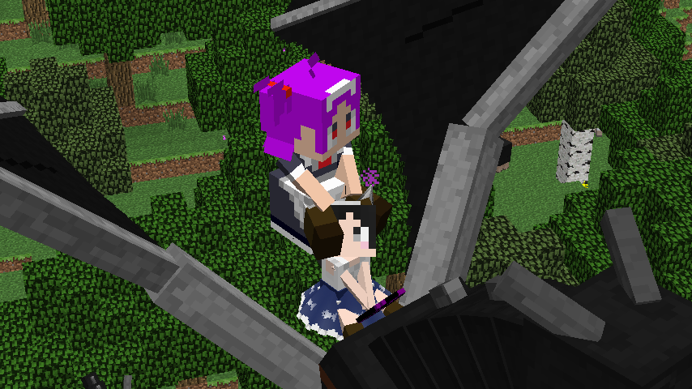

LittleMaidDragon(リトルメイドドラゴン)
====================

## 概要

DragonMounts のエンダードラゴンに、littleMaidMob のメイドさんへの変身能力を追加します。

## スクリーンショット

## 前提

- Minecraft 1.6.2
- MinecraftForge 1.6.2
- YMTLib 162v2
- MMM 氏製作の littleMaidMob 1.6.2-1
- BarracudaATA 氏製作の dragonmount_r36_mc1.6.x (Forge版)

## 導入

mods に zip のまま放り込んでください。
導入前にバックアップを取るのも忘れずに。".minecraft" 自体をバックアップするのがお手軽です。

## 利用条件

この MOD は Apache License(ver2.0) の下で配布されます。

    http://www.apache.org/licenses/LICENSE-2.0

- この MOD を使用したことにより発生したいかなる結果についても、製作者は一切の責任を負いません。
- この MOD は変更の有無にかかわらず再頒布が可能です。Apache License を確認してください。

この MOD または派生成果物は、それが minecraft を前提としている場合に、
minecraft 自体の利用条件に縛られることに注意してください。
利用条件の詳細は minecraft の利用規約を確認してください。

## Tips

- テイム中のエンダードラゴンに砂糖を与えると、メイドさんに変身します。
- メイドさんに変身したエンダードラゴンは、サドルを持たせてアクティブにすると元の姿に戻ります。
- その他の挙動は、DragonMounts および littleMaidMob とだいたい同じです。

## 注意点

mods から zip を除去すると、メイドさん形態の情報は世界から消失しますが、DragonMounts のエンダードラゴンの情報は残ります。
なのでアンインストールの時には、メイドさんから貴重品を預かって、ドラゴンの姿に戻してから行うと良いと思います。

## Copyright 2013 Yamato

Licensed under the Apache License, Version 2.0 (the "License");
you may not use this file except in compliance with the License.
You may obtain a copy of the License at

    http://www.apache.org/licenses/LICENSE-2.0

Unless required by applicable law or agreed to in writing, software
distributed under the License is distributed on an "AS IS" BASIS,
WITHOUT WARRANTIES OR CONDITIONS OF ANY KIND, either express or implied.
See the License for the specific language governing permissions and
limitations under the License.

## History

- 162v3: DragonMounts のバージョンアップ(dragonmount_r34_mc1.6.x以降)に対応、砂糖に反応しない時はワールド読み込みなおしてみてください。
- 162v2: DragonMounts のバージョンアップ(dragonmount_r32_mc1.6.x以降)に対応。
- 162v1: Minecraft1.6.2 対応。
- 152v2: LittleMaidMob のバージョンアップ(1.5.2-4)に対応。
- 152v1: Minecraft1.5.2 対応。
- 151v2: MOD 読み込み順、およびDragonEggBlockの右クリックオーバーライドが上手く機能していなかったことに対処。
- 151v1: Minecraft1.5.1 対応。なおプレイヤー落下中に救出する機能は取り外し。
- 147v2: プレイヤー落下中に救出する機能をデフォルトOFFに。設定はConfigから。
- 147v1: 初版
